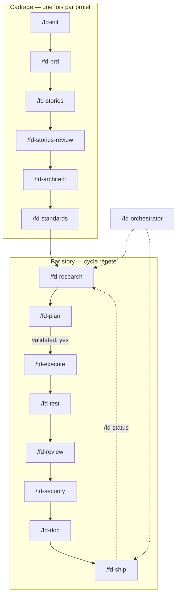

# flash-dev — documentation complète

## 1. Philosophie

flash-dev généralise le principe de killer-saas (« no direct coding », un
pipeline de commandes plutôt qu'un prompt libre) à tout le cycle de vie
d'un projet logiciel, pas seulement la reconstruction d'un SaaS existant :

- démarrer un nouveau projet,
- livrer une nouvelle fonctionnalité,
- maintenir des tests, de la documentation, un backlog,
- garantir en continu clean code et sécurité.

L'agent ne code jamais "à la volée" une fonctionnalité produit : il passe
par recherche → plan écrit et validé par un humain → exécution → tests →
review → sécurité → doc → ship. Le prompt seul n'étant pas une garantie
suffisante, un mode d'enforcement au niveau git (`--hooks`) rend ces gates
vérifiables même si l'outil IA change.

## 2. Vue d'ensemble du pipeline



## 3. États d'une story

| État        | Déclenché par         | Fichier associé                  |
|-------------|------------------------|-----------------------------------|
| todo        | `/fd-stories`           | `docs/stories.md`                 |
| researched  | `/fd-research`          | `docs/research/<id>.md`           |
| planned     | `/fd-plan`              | `docs/plans/<id>.md` (`validated: no`) |
| validated   | relecture humaine       | `docs/plans/<id>.md` (`validated: yes`) |
| executed    | `/fd-execute`           | code + `docs/plans/<id>.md`       |
| tested      | `/fd-test`              | rapport de tests                  |
| reviewed    | `/fd-review`            | `docs/reviews/<id>.md`            |
| secured     | `/fd-security`          | `docs/reviews/<id>.md` (section sécurité) |
| documented  | `/fd-doc`               | README / API docs / changelog     |
| shipped     | `/fd-ship`               | `docs/reviews/<id>.md` (`Ship allowed: yes`) |

## 4. Commandes (`/fd-*`)

### Cadrage (une fois par projet)

| Commande            | Rôle |
|---------------------|------|
| `/fd-init`           | Bootstrap d'un nouveau projet : scaffolding, config lint/format, CI minimale, baseline sécurité (secrets scanning, dépendances). |
| `/fd-prd`            | Rédige/actualise le PRD (`docs/prd.md`). |
| `/fd-stories`        | Découpe le PRD en stories indépendantes et séquencées (`docs/stories.md`). |
| `/fd-stories-review` | Relit les stories : dépendances, taille, ambiguïté, critères d'acceptation. |
| `/fd-architect`      | Produit/actualise l'architecture (`docs/architecture.md`) et les ADR. |
| `/fd-standards`      | Définit les conventions clean code + sécurité (`docs/standards.md`). |

### Cycle par story

| Commande       | Rôle |
|----------------|------|
| `/fd-research`  | Explore le code existant, le domaine, les contraintes et risques d'une story. |
| `/fd-plan`      | Écrit un plan d'implémentation détaillé ; gate `validated: no` par défaut. |
| `/fd-execute`   | Implémente strictement selon le plan validé — refuse sinon. |
| `/fd-test`      | Écrit et exécute les tests (unitaires + intégration), rapporte la couverture. |
| `/fd-review`    | Revue clean code : complexité, duplication, nommage, lisibilité. |
| `/fd-security`  | Revue sécurité : secrets, dépendances, authn/z, injections, checklist OWASP. |
| `/fd-doc`       | Met à jour la documentation impactée (README, API, changelog). |
| `/fd-ship`      | Gate final : merge/release seulement si plan validé + tests OK + review OK + sécurité OK. |

### Transverse

| Commande          | Rôle |
|-------------------|------|
| `/fd-status`        | Dashboard de l'état réel de chaque story (lu depuis le disque, pas mémorisé). |
| `/fd-backlog`       | Gère la roadmap : ajout, priorisation, sizing, découpage de stories. |
| `/fd-orchestrator`  | Enchaîne tout le cycle d'une story avec des checkpoints humains. |
| `/fd-help`          | Carte du pipeline, aide-mémoire des commandes. |

## 5. Skills auto-déclenchées

Contrairement aux commandes (appelées explicitement), les skills se
déclenchent seules quand le contexte correspond :

| Skill              | Se déclenche quand… |
|---------------------|----------------------|
| `clean-code`        | du code source est écrit ou modifié. |
| `security-review`   | le code touche l'auth, des secrets, des dépendances ou des entrées utilisateur. |
| `test-writer`       | une story entre en phase test ou qu'une régression est détectée. |
| `doc-writer`        | un comportement visible (API/CLI/config) change. |

## 6. Enforcement git (`--hooks`)

- **pre-commit** — refuse un commit de code sur une branche `feature/<id>`
  si `docs/plans/<id>.md` n'existe pas ou si `validated: no`. Les commits
  docs-only passent toujours.
- **pre-push** — refuse de pousser la branche par défaut si une story
  mergée n'a pas de `docs/reviews/<id>.md` avec `Ship allowed: yes`.

Réversible : `git config --unset core.hooksPath`.

## 7. Arborescence livrée dans un projet

```
mon-projet/
├── AGENTS.md                  # règles (jamais écrasé par update)
├── CLAUDE.md                  # importe AGENTS.md
├── .claude/
│   ├── commands/fd-*.md
│   └── skills/*/SKILL.md
├── .fd-manifest                # liste des fichiers installés (pour update propre)
├── .fd-version
├── .githooks/                  # si --hooks (pre-commit, pre-push)
└── docs/
    ├── prd.md
    ├── stories.md
    ├── architecture.md
    ├── standards.md
    ├── research/<id>.md
    ├── plans/<id>.md
    ├── reviews/<id>.md
    └── templates/               # gabarits, copiés une fois, jamais écrasés sans --force
```

## 8. Ce que l'installeur ne fait jamais

- ne touche pas `AGENTS.md` lors d'un `update` (à merger à la main),
- n'écrase pas un template modifié localement sans `--force`,
- ne supprime jamais un fichier renommé/retiré par l'utilisateur en dehors
  du manifest.
